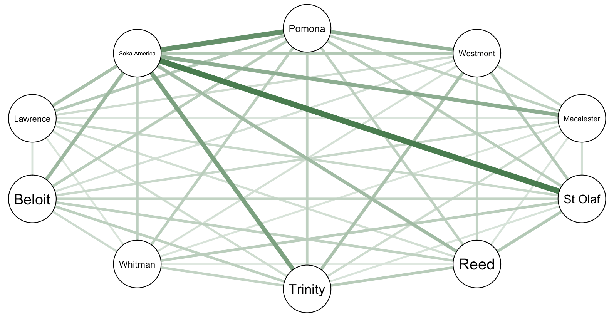

# An Alternative to Rank-Based College Exploration

This repository contains source code for a project for Statistics Practicum (MATH 343) in Spring 2019, advised by [Dr. Kelly McConville](https://github.com/mcconvil). The final paper is available as `paper.pdf`, and the app is currently live [here](https://shiny.reed.edu/s/users/couchs/colleges/).

Rank-based college exploration, such as that popularized by U.S. News College Rankings, plays a pivotal role in how prospective college students discover and compare potential schools. However, despite its popularity, embedding hierarchy into college exploration reaffirms entrenched status obsession more than it educates and informs. We propose and implement an alternative method for prospective students and institutional researchers to evaluate colleges focusing on what makes a college similar to, not better than, another college. Data from IPEDS and the Mobility Report Card from the Equality of Opportunity Project are joined and provided to users in an R Shiny application that allows users to compare United States educational institutions through visualization, comparison of raw data, and model-based assessment of school similarity.

Authored by [EJ Arce](https://github.com/ejarce), [Simon Couch](https://github.com/simonpcouch), and [Alexander Moore](https://github.com/moorea1).